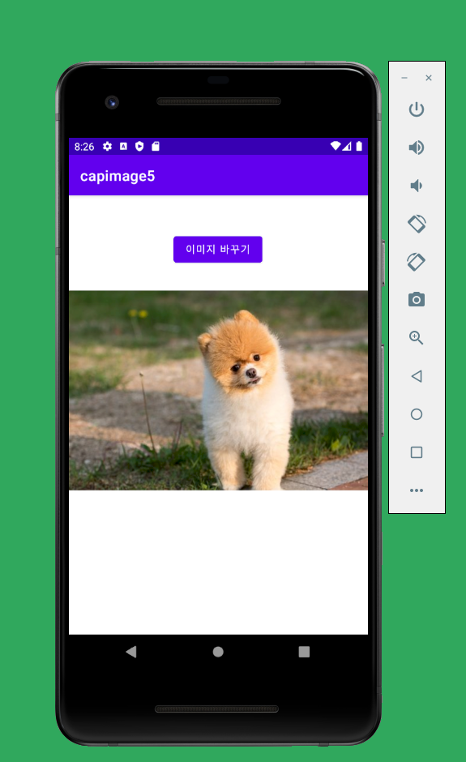
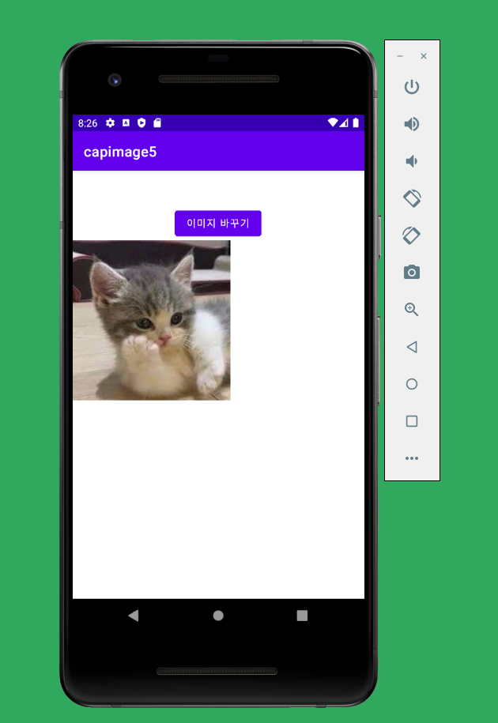

# 19173053 이소현

## 1주차 과제
</img>

## 2주차 과제
</img>

## 3주차 과제

</img>
</img>

## 4주차 과제

  - 알람 앱(기존 앱 보완)
    
    보통 알람 앱은 간단한 문제 풀기, 퍼즐 맞추기 등의 미션을 통해 기상을 도와주는데,
    경험상 누워서도 할 수 있는 미션은 하고 난 후에 다시 잘 가능성이 높다고 생각해서
    최대한 일어나서 움직이는 미션으로 정해 보았다.
    
    만보기 기능: 몇 보 이상 걸어야 알람이 꺼짐
    
    사진 찍기: 구름이 나오게 사진을 찍어야 알람이 꺼짐
    
    
## 5주차 과제
 </img>
 </img>
 
## 6주차 과제
</img>
</img>
</img>
</img>
 
      
    
